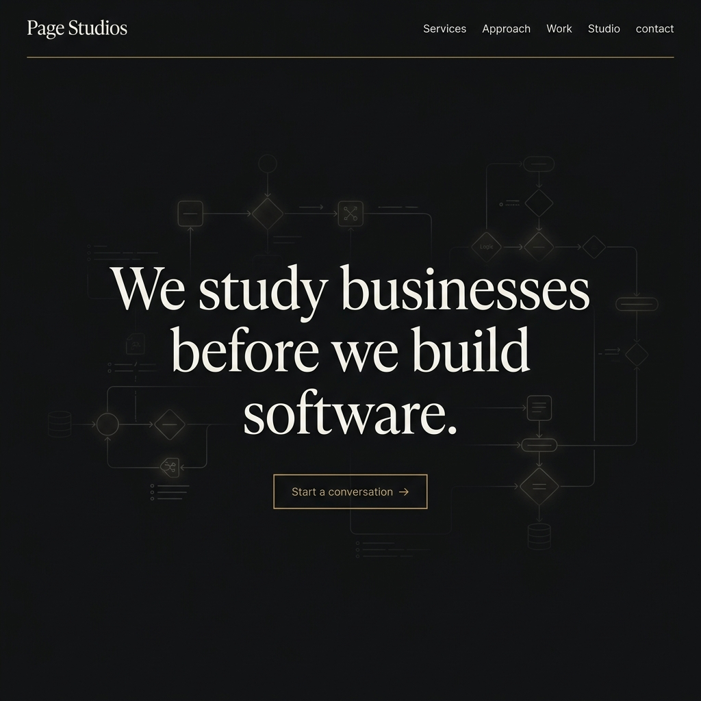

# Page Studios: Business Systems & AI Engineering
> We study businesses before we build software.



**Live Demo → [https://page-bay-five.vercel.app](https://page-bay-five.vercel.app)**

---

## ⚡ Introduction

Page Studios is a business systems and AI engineering company. We design and build secure, custom operational software, AI agents, and custom visual dashboards. This repository contains the source code for the Page Studios portfolio-grade agency website, migrated to Next.js App Router with smooth inertial scrolling and high-fidelity motion transitions.

---

## 🛠 Tech Stack

- **Framework:** Next.js 15 (App Router layout) + TailwindCSS
- **Animations:** GSAP + Framer Motion (respecting `prefers-reduced-motion`)
- **Scroller:** Lenis Smooth Scroll
- **Typeface:** Custom editorial font stack (GT Super serif class display + Inter sans UI)
- **Deployment:** Vercel Static Web Hosting

---

## 📂 Repository Directory Layout

```
page/
 ├── public/                    # Static asset files
 │    ├── assets/               # Gradients and mockups (e.g. outreach, knowledgeflow)
 ├── src/
 │    ├── app/                  # Pages and dynamic work routes
 │    ├── components/           # Custom animations and spine components (Preloader, PageSpine, CaseStudies)
 ├── tsconfig.json              # TypeScript strict options configuration
 └── README.md                  # Landing documentation
```

---

## 🚀 Quick Start Guide

### 1. Clone & Install
```bash
git clone https://github.com/sanikasadre/page.git && cd page
npm install
```

### 2. Development Server
```bash
npm run dev
# Open http://localhost:3000 to preview the local environment
```

### 3. Production Build
```bash
npm run build
# Creates an optimized production build in .next
```

---

## ⚖ License

Distributed under the MIT License. See `LICENSE` for more information.
